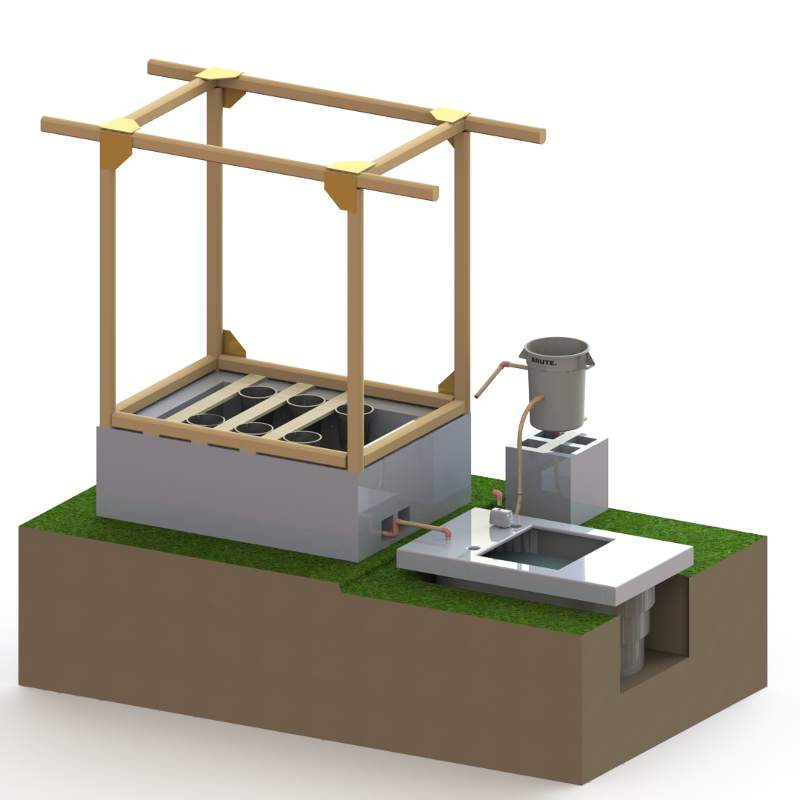

## Welcome
_opengrow is an open source engineering project for modern small-scale farming.  If you love gardening and technology, you'll find designs here to support your DIY projects for aquaponics & hydroponics, and automated garden systems. The difference between this project and many others is that it's supported by real engineers with knowledge of mechanical systems, fluids, electronics, & software._

This webpage will be made to describe the free designs available for the system shown in the following video:

<iframe width="750" src="https://www.youtube.com/embed/id8U4BQd-kE" title="OpenGrow Aquaponics Design (tested &amp; validated) with CAD model" frameborder="0" allow="accelerometer; autoplay; clipboard-write; encrypted-media; gyroscope; picture-in-picture; web-share" referrerpolicy="strict-origin-when-cross-origin" allowfullscreen></iframe>

## Designs
* Find 3D Models for the designs featured in the video above, on grabCAD
* Explore the [Model Here](https://grabcad.com/library/opengrow-1)

Here's a snapshot of the self-contained circulating aquaponics system.  By omitting the aquarium, this can be simplified into a hydroponics system.

## More Projects
>
> More open source designs:
>
> | Project | Link | Purpose | 
> | --------------- | ---------------------- | -------------------------------------------------------- | 
> | OpenAir | [qr.net/openairproject](https://qr.net/openairproject) | take control of air, pressure, & flow with open elements | 
> | OpenArm | [qr.net/openarmproject](https://qr.net/openarmproject) | revolutionize robotic arms, a 10-year goal | 
> | OpenBox | [qr.net/openboxproject](https://qr.net/openboxproject) | array of open designs beginning with a steel box | 
> | OpenGrow | [qr.net/opengrowproject](https://qr.net/opengrowproject) | open designs for hydroponics & aquaponics systems | 
> | OpenJar | [qr.net/openjarproject](https://qr.net/openjarproject) | array of designs for standard jars, threads, & seals | 
> | OpenLab | [qr.net/openlabproject](https://qr.net/openlabproject) | build a laboratory to design & fabricate anything. |
> | openME | [qr.net/openmeproject](https://qr.net/openmeproject) | a Mechanical Engineering degree, comprehensive & free, in-progress | 
> | OpenSpin | [qr.net/openspinproject](https://qr.net/openspinproject) | array of designs based on parametric bearings | 
> | SCUTTLE_Nigeria | [qr.net/scuttleafrica](https://qr.net/scuttleafrica) | university-level robotics lab in Lagos, Nigeria |
>
