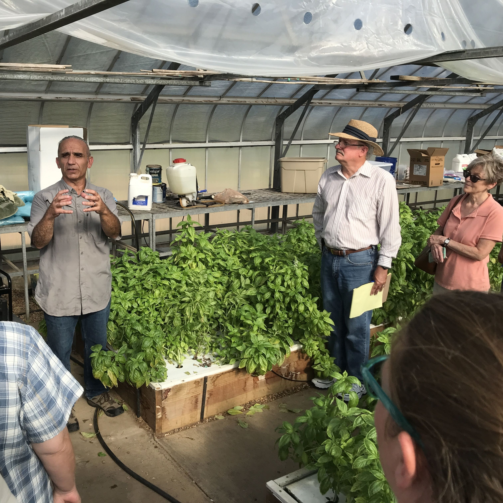
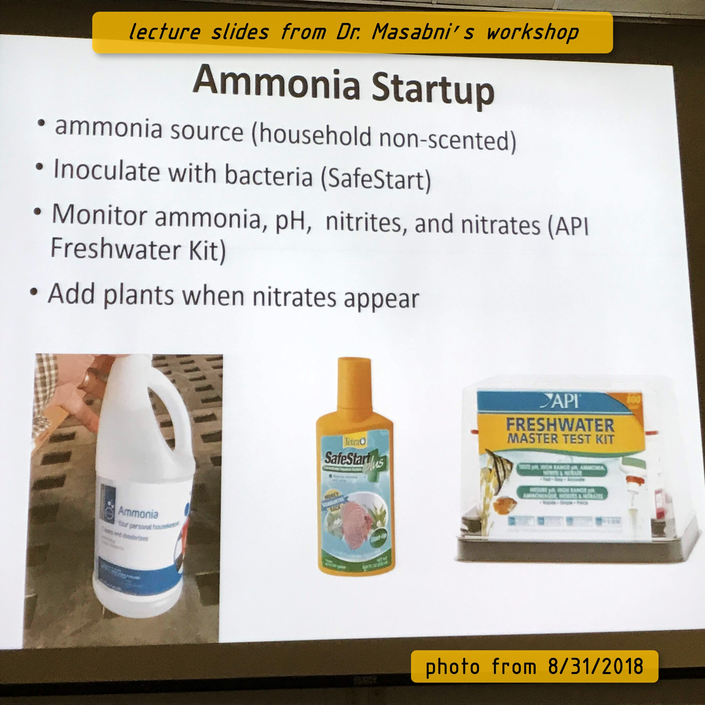
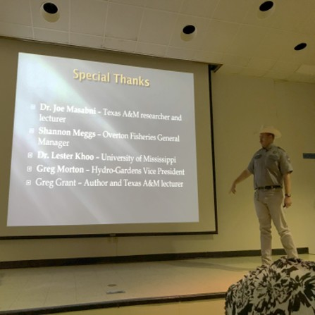

# Research

Here I'll organize the documents that I studied before I started my system, and make notes about the key factors taken from research into the design.

## Challenge
The key challenge (what makes this unique) is to eliminate or reduce the energy required to perform hydroponics - this is achieved by allowing sunlight into the design.  But of course the outdoor scenario that allows sunlight also creates many difficulties.  The design here is all about overcoming those difficulties.

**BarrelPonics Manual** Documentation 
has a full document authored in 2005 by Travis Hughey.  As of 2018 this was one of the few documents which DOES IN FACT 
* list the actual components of the design
* tell a story AFTER operating multiple seasons
* describe the challenges, highlights, and design elements with PHOTOS.
* download the [BarrelPonics Manual PDF](https://github.com/davidmalawey/openGrow/blob/b41253418fe4597de12dad7861d77928c70d4b18/docs/2005_BarrelponicsManual.pdf)
  
## Mentorship
Before starting my build, I made several visits to aquaponics and hydroponics farms and found myself a mentor.  Although he may not know it, I allocated Dr. Joe Masabni as my aquaponics mentor.  I think it is important for everyone to do the same.  Why is it crucial to have a mentor?  It's where you'll go to answer these questions.

* Who is growing plants in the same climate region as I am doing?
* Who can answer a question when I do my research and need to understand something better?
* Who is educated in a way that complements my own expertise? (ie, I'm a mechanical engineer and Joe is a Horticulture researcher).
* Who published the papers that I have read regarding my choice of crops, watering system, and design details?

* Find [Joe Masabni, PhD on Youtube](https://www.youtube.com/@joemasabni9709)

-
-
-
